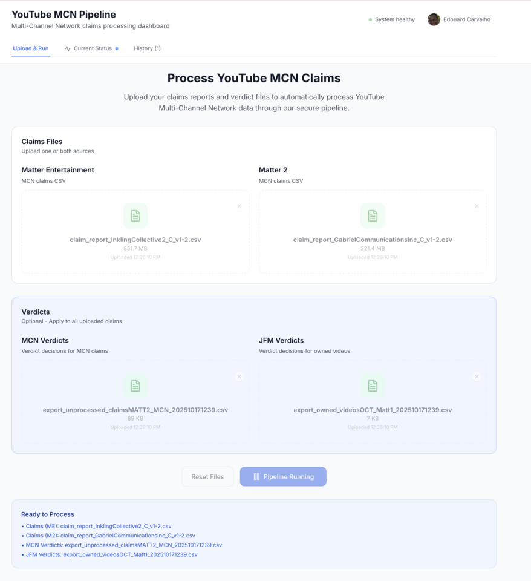
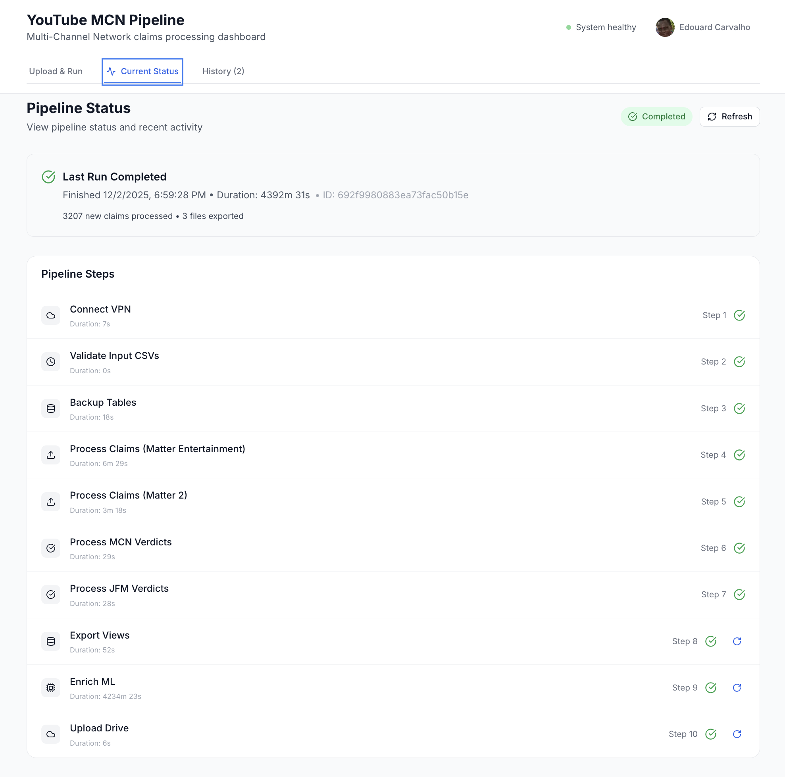
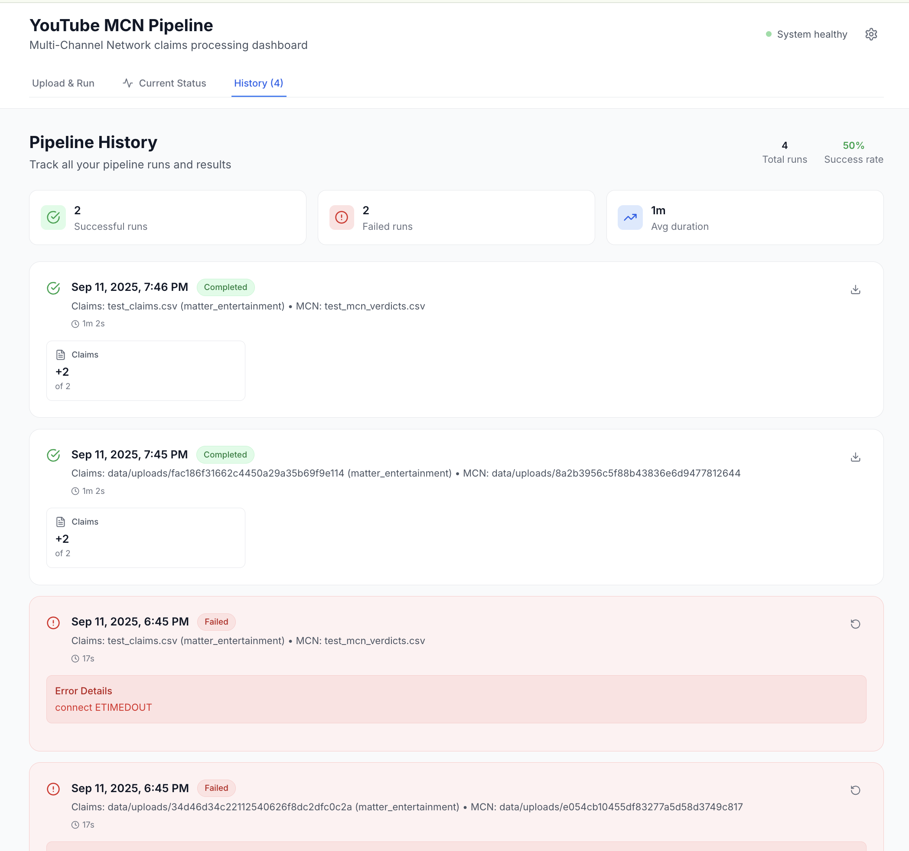
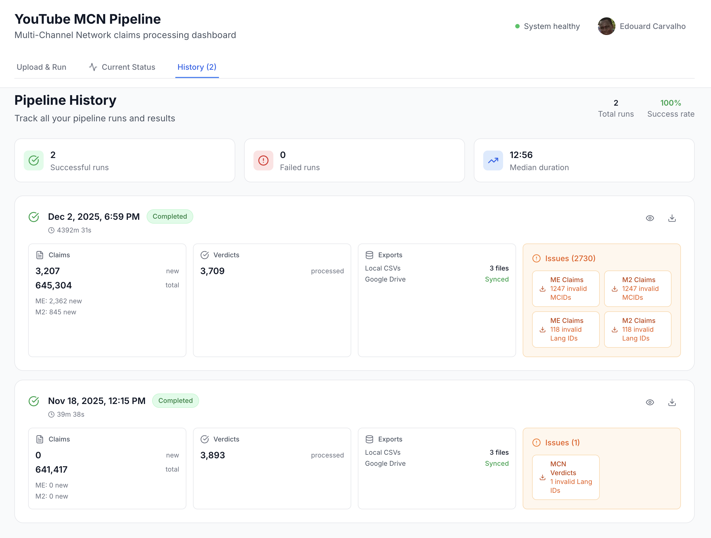

# ytdt-claims-console

This is a [Next.js](https://nextjs.org) frontend for [`ytdt-claims-pipeline`](https://github.com/ceduth/ytdt-claims-pipeline).


<div style="display:flex; gap:5px;">
  
  
  
</div>


## Getting Started


1. Start the backend. RTD at [`ytdt-claims-pipeline`](https://github.com/ceduth/ytdt-claims-pipeline)
2. Start ML enrichment sub-pipeline [`YT-Validator`](https://github.com/matthew-jf/YT-Validator) 
3. Run the development server:

```bash
PORT=3001 \
NEXT_PUBLIC_API_URL=http://localhost:3000 \
npm run dev
```

Optionally reading envs from file:
```shell
cp .env.example .env.local
```

3. Point your browser at [http://localhost:3002](http://localhost:3002).


