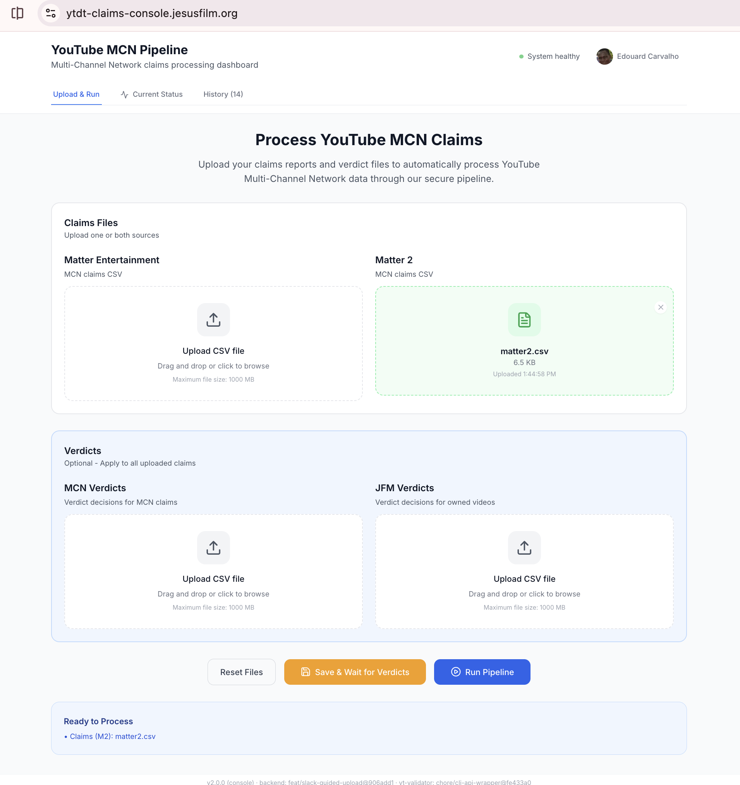
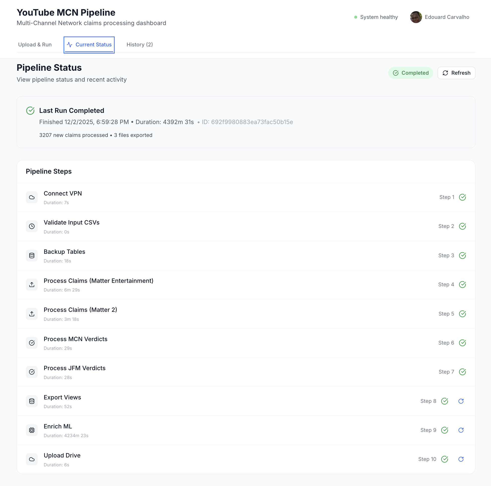
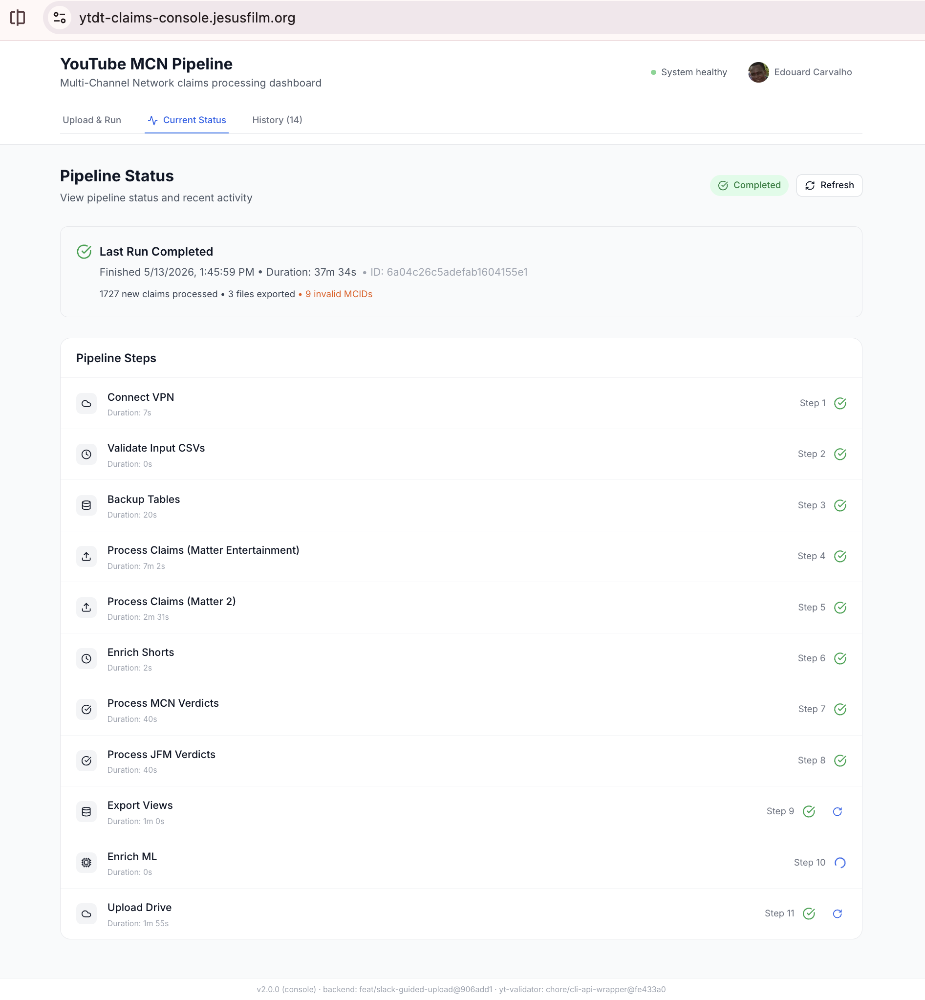
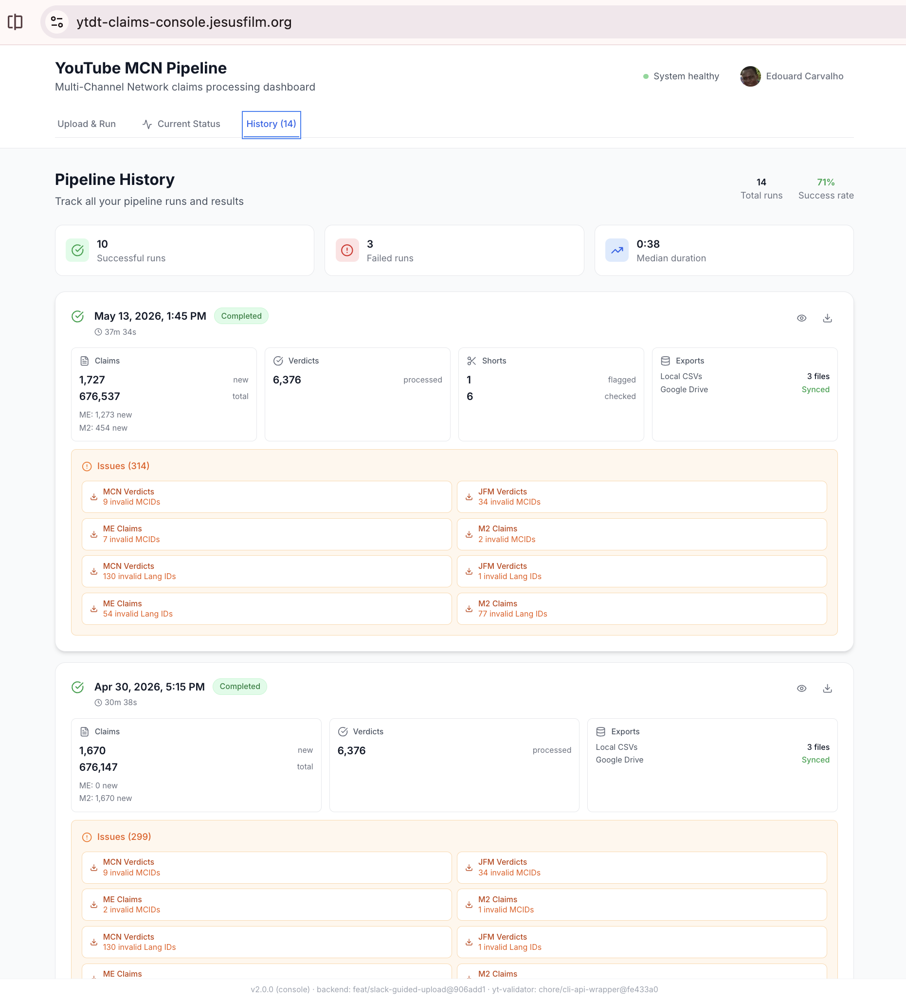

# ytdt-claims-console

This is a [Next.js](https://nextjs.org) frontend for [`ytdt-claims-pipeline`](https://github.com/ceduth/ytdt-claims-pipeline).



<div style="display:flex; gap:5px;">
  
  
  
</div>

## Getting Started

1. Start the backend. RTD at [`ytdt-claims-pipeline`](https://github.com/ceduth/ytdt-claims-pipeline)
2. Start ML enrichment sub-pipeline [`YT-Validator`](https://github.com/matthew-jf/YT-Validator)
3. Copy and configure environment variables:

```shell
cp .env.example .env.local
```

4. Run the development server:

```bash
pnpm dev
```

5. Point your browser at [http://localhost:3002](http://localhost:3002).

## Deploy ytdt-console to Vercel (or create in Vercel console)

```shell
# Enter backend URL (e.g., https://ytdt-claims-pipeline-xyz.run.app)
vercel env add NEXT_PUBLIC_API_URL production

# Deploy
vercel --prod
```
